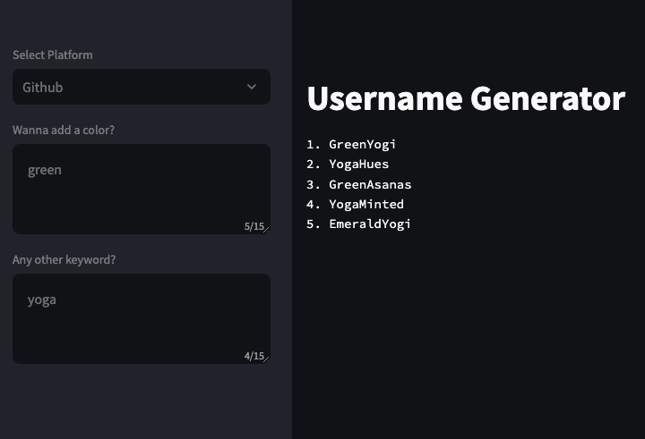

# LangChain Crash Course

This project is accompanying the FreeCodeCamp Tutorial on Youtube: https://www.youtube.com/watch?v=lG7Uxts9SXs (in my own way).

## Setup

\*on Mac

1. create virtual env in directory

   `python3 -m venv .venv`

2. activate that venv

   `source .venv/bin/activate`

3. install pip packages

   `pip3 install langchain-openai streamlit python-dotenv`

4. install any tools that you want the agent to be able to use

   `pip3 install wikipedia`

## Run the App

- navigate into the root directory
- run CLI command `streamlit run main.py`
- this will run a local app in the browser at port `8501`

## Run the functions in isolation (for testing)

`python3 langchain-helper.py`
